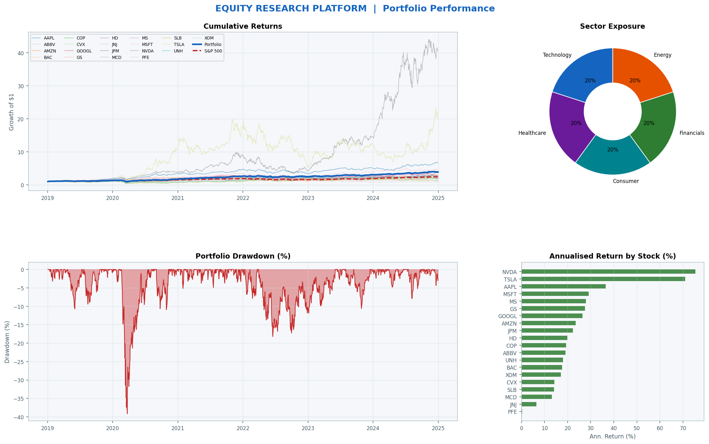
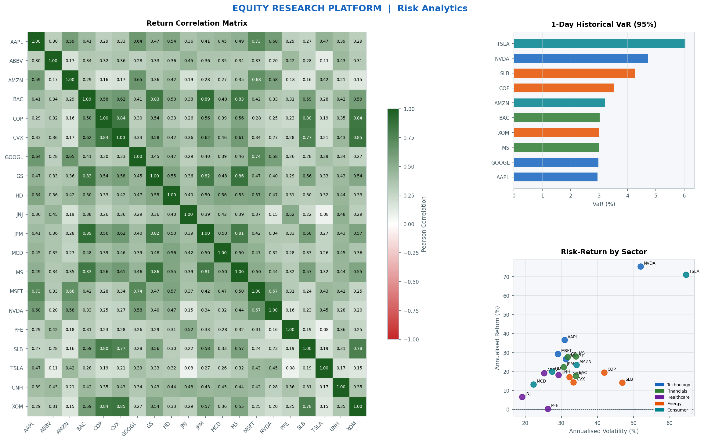
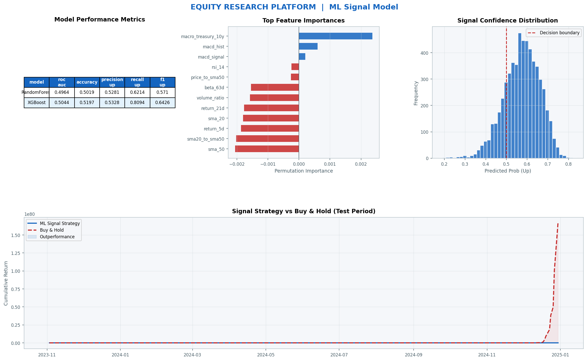
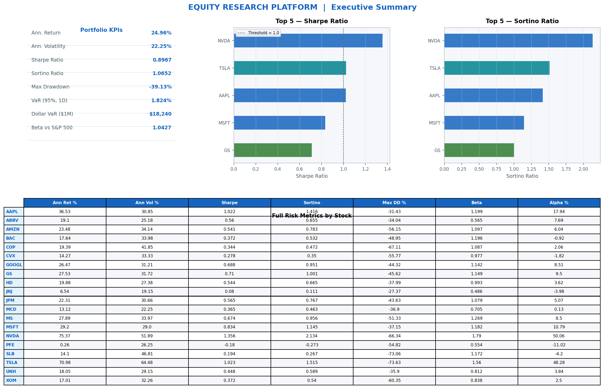

# 📊 Equity Research & Portfolio Risk Analytics Platform

> A full end-to-end quantitative finance project built for investment banking and capital markets roles.
> Covers data engineering, portfolio risk analytics, machine learning signal generation, and professional dashboard reporting.

---

## 🏦 Project Overview

This platform analyses a **20-stock equal-weight portfolio** drawn from 5 S&P 500 sectors across a 6-year period (2019–2024). It replicates the kind of quantitative workflow used by analysts on trading desks and in risk management teams at investment banks.

| Module | Description | Tools |
|--------|-------------|-------|
| **1. Data Engineering** | Fetch stock prices, macro indicators, build SQL database, engineer 20 financial features | Python, yfinance, SQLite, Pandas |
| **2. Risk Analytics** | VaR (3 methods), CVaR, Sharpe, Sortino, Calmar, Max Drawdown, Beta, Alpha, Correlation Matrix | NumPy, SciPy, Matplotlib |
| **3. ML Signal Model** | Predict next-day return direction using Random Forest + XGBoost, walk-forward validation | scikit-learn, XGBoost |
| **4. Dashboard & Memo** | 4-page professional dashboard + investment memo auto-populated with real results | Matplotlib, python-docx |

---

<<<<<<< HEAD
## 📸 Dashboard Preview

### Page 1 — Portfolio Performance


### Page 2 — Risk Heatmap & Correlation


### Page 3 — ML Signal Tracker


### Page 4 — Executive Summary


=======
>>>>>>> 427b5c6b74422654dc99f9a98150519cf5fe91b3
## 📁 Project Structure

```
equity_project/
│
├── config.py                  # Stock universe, date range, macro series
├── schema_models.py           # SQLAlchemy database schema
├── requirements.txt           # Python dependencies
├── .env.example               # Environment variable template
│
├── 02_fetch_stocks.py         # Module 1 — Fetch OHLCV data (Yahoo Finance)
├── 03_fetch_macro.py          # Module 1 — Fetch macro indicators (FRED API)
├── 04_engineer_features.py    # Module 1 — Compute 20 financial features
│
├── 05_risk_analytics.py       # Module 2 — VaR, Sharpe, correlation matrix
├── 06_ml_model.py             # Module 3 — ML signal model + backtest
│
├── 07_dashboard.py            # Module 4 — 4-page dashboard (PNG)
├── 08_investment_memo.py      # Module 4 — Investment memo (Word doc)
│
├── risk_output/               # Module 2 outputs (CSVs + charts)
├── ml_output/                 # Module 3 outputs (CSVs + charts)
└── dashboard_output/          # Module 4 outputs (dashboard + memo)
```

---

## 🚀 Getting Started

### 1. Clone the repository
```bash
git clone https://github.com/yashpatel1203/equity-research-platform.git
cd equity-research-platform
```

### 2. Install dependencies
```bash
pip install -r requirements.txt
```

### 3. Configure environment
```bash
cp .env.example .env
# Add your free FRED API key at https://fred.stlouisfed.org/docs/api/api_key.html
# Leave blank to use synthetic macro data for development
```

### 4. Run the full pipeline
```bash
python 02_fetch_stocks.py        # ~5 min
python 03_fetch_macro.py         # ~1 min
python 04_engineer_features.py   # ~2 min
python 05_risk_analytics.py      # Module 2
python 06_ml_model.py            # Module 3
python 07_dashboard.py           # Module 4 — dashboard
python 08_investment_memo.py     # Module 4 — memo
```

---

## 📈 Key Results

### Portfolio Risk Metrics
- **Value at Risk** computed using 3 methods: Historical Simulation, Parametric, and Monte Carlo
- **Expected Shortfall (CVaR)** — required under Basel III for institutional risk reporting
- **Sharpe & Sortino Ratios** — risk-adjusted return with downside-only penalty
- **Rolling Beta & Jensen's Alpha** — CAPM-based market sensitivity analysis

### Machine Learning Signal Model
- **Walk-forward validation** — strict temporal split, no data leakage
- **TimeSeriesSplit cross-validation** — 5 folds, each testing on a future window
- **Signal backtest** — compares strategy returns vs buy-and-hold benchmark
- **Permutation feature importance** — identifies which indicators drive the signal

### Dashboard Pages
| Page | Content |
|------|---------|
| 1 | Cumulative returns vs S&P 500, drawdown, sector exposure, performance ranking |
| 2 | Correlation heatmap, VaR comparison, risk-return scatter by sector |
| 3 | ML model metrics, feature importance, signal backtest vs buy-and-hold |
| 4 | Portfolio KPI cards, top Sharpe/Sortino picks, full metrics table |

---

## 🗄️ Database Schema

| Table | Description |
|-------|-------------|
| `stock_prices` | Daily OHLCV for 20 stocks (~25,000 rows) |
| `benchmark_prices` | S&P 500 daily prices + returns |
| `macro_data` | FRED macro indicators (VIX, rates, CPI) |
| `stock_features` | 20 engineered features + ML target |

---

## 🧠 Features Engineered

| Category | Features |
|----------|----------|
| Returns | Daily, log, 5-day, 21-day |
| Volatility | 21-day and 63-day annualised rolling std |
| Trend | SMA-20/50, EMA-12/26, MACD + signal line |
| Momentum | RSI-14, Rate of Change (10-day) |
| Volume | 20-day avg volume, volume ratio |
| Risk | Rolling 63-day beta vs S&P 500 |
| Price position | Price vs SMA-20/50, golden cross signal |
| Macro | VIX, 10Y treasury yield, Fed Funds Rate |

---

## 📚 Finance Concepts Demonstrated

- **VaR & CVaR** — Basel III risk framework used by institutional banks
- **CAPM** — Beta and Jensen's Alpha
- **Sharpe vs Sortino** — Why downside-only risk measurement matters
- **Walk-forward validation** — Preventing data leakage in financial ML
- **Signal generation** — How to frame ML in a quantitative trading context

---

## 🛠️ Tech Stack

`Python` `Pandas` `NumPy` `SciPy` `SQLAlchemy` `SQLite` `yfinance` `scikit-learn` `XGBoost` `Matplotlib` `python-docx`

---

## ⚠️ Disclaimer

Educational purposes only. Not investment advice.

---

## 👤 Author

Built as a data analysis portfolio project targeting investment banking and capital markets roles.

[![LinkedIn]](https://www.linkedin.com/in/yash-patel-4b7518270/)
[![GitHub]](https://github.com/yashpatel1203)
